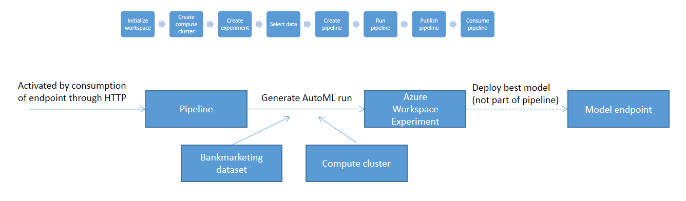

## Azure ML Ops: Overview of the project
This project aimed at operationalizing a machine learning model. It used a bank marketing dataset where the object The data is related with direct marketing campaigns (phone calls) of a Portuguese banking institution. The classification goal is to predict if the client will subscribe a term deposit (variable y) (Copied from https://archive.ics.uci.edu/ml/datasets/bank+marketing). An AutoML pipeline was developed which used the bankmarketing dataset and predicted variable y. This pipeline is an automated, reusable and reproducible way to train machine learning models. 

## Architectural diagram & Key steps

The top of this image shows the key steps that where taken sequentially. The bottom shows the interaction of the different components. The pipeline itself is quite simple since it only consists of an AutoML step, which trains a model with a specific dataset while using a certain compute. No model deployment is included in the pipeline.

## Possible improvements
The project can be improved in multiple ways:
- improve prediction accuracy (standard techniques such as more data, feature engineering, different models)
- Extending the pipeline with deployment of the best model to an HTTP endpoint to be able to train a working model by consuming a HTTP endpoint
- Making the pipeline more flexible by giving it the option to specify the dataset and target column, this way we create another way to use Azure apart from the SDK and the Portal.

## [Link to Youtube screencast](https://youtu.be/_OzylQjI5Zw)

## Screenshots, all available in project_files/screenshots directory
Creation of the service principal

Creation of dataset

Completion of AutoML run

Selection of best model

Details of best model

Logs python script output

Enabled application insights

Swagger top of page

Swagger bottom of page

Result of API consumption

Benchmarking with Apache top op page

Benchmarking with Apache bottom of page

Creation of pipeline

Active pipeline endpoint

Detail of active pipeline endpoint

Bankmarketing dataset used as input for AutoML step

Pipeline run

Run_detail output from jupyter
