## Azure ML Ops: Overview of the project
This project aimed at operationalizing a machine learning model. It used a bank marketing dataset related with direct marketing campaigns (phone calls) of a Portuguese banking institution. The classification goal is to predict if the client will subscribe a term deposit (variable y) (Copied from https://archive.ics.uci.edu/ml/datasets/bank+marketing). An pipeline was developed which trained an AutoML model usingh the bankmarketing dataset. This pipeline is an automated, reusable and reproducible way to train machine learning models. In addition, an AutoML endpoint was deployed for inference.

## Architectural diagram & Key steps

The top of this image shows the key steps that where taken sequentially for development of the pipeline. The bottom shows the interaction of the different components. The pipeline itself is quite simple since it only consists of an AutoML step, which trains a model with a specific dataset while using a certain compute. No model deployment is included in the pipeline. However it was part of the project, this is why it is shown with a dotted line in the bottom block diagram.

## Possible improvements
The project can be improved in multiple ways:
- Improve prediction accuracy (standard techniques such as more data, feature engineering, training on different models)
- Extending the pipeline with deployment of the best model to an endpoint to be able to train an deploy a working model by consuming a HTTP endpoint
- Making the pipeline more flexible by giving it the option to specify the dataset and target column, this way we create another way to use Azure AutoML apart from the SDK and the Portal.

## [Link to Youtube screencast](https://youtu.be/_OzylQjI5Zw)

## Screenshots, all available in project_files/screenshots directory
Creation of the service principal. This is necessary in order to work with authentication
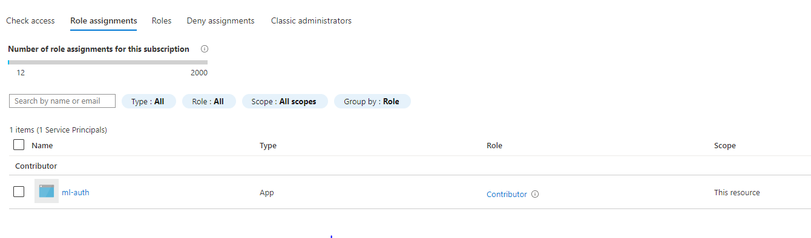
Creation of dataset. Storage of the dataset in Azure makes it easy to re-use the same data for multiple models.
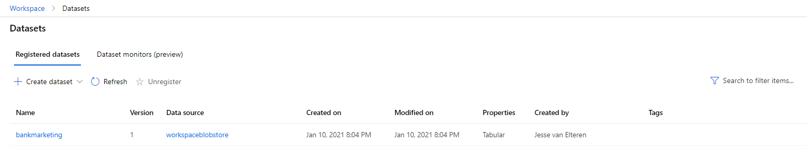
Completion of AutoML run. An experiment is a group of runs, which itself also can consist of runs. For example this AutoML run consists of multiple sub-runs training different models. As shown, it takes about 30 minutes.
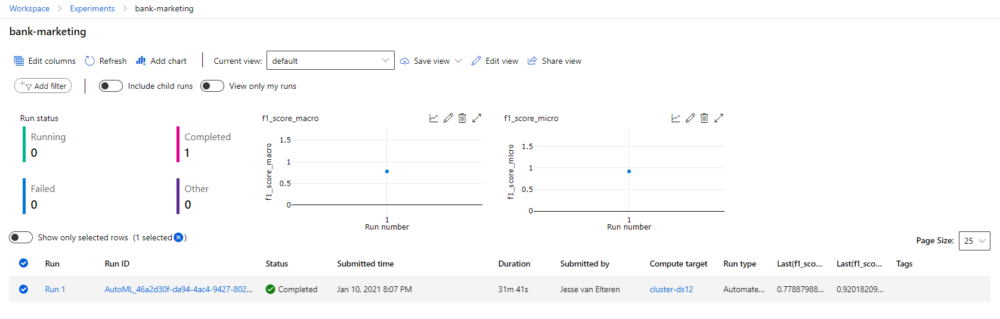
More detail on the completed run, this shows some descriptives of the run, what kind of machine learning problem it is, some detailed of the best model.
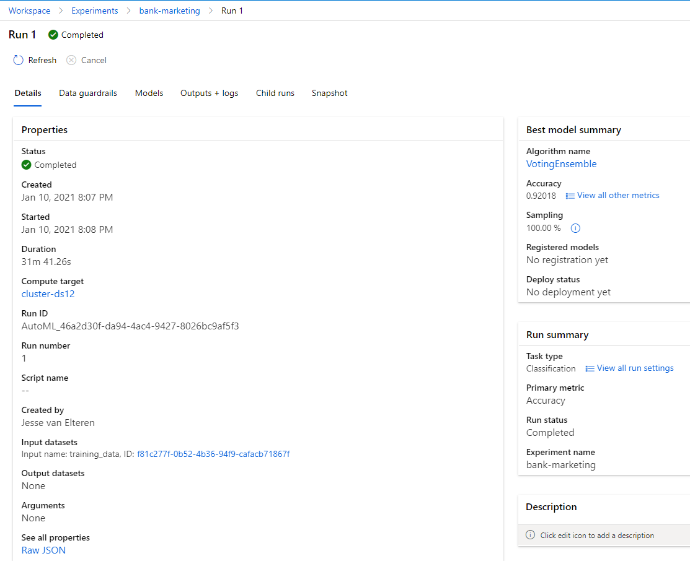
Selection of best model. In this case a VotingEnsemble performed best with 0.92 accuracy.
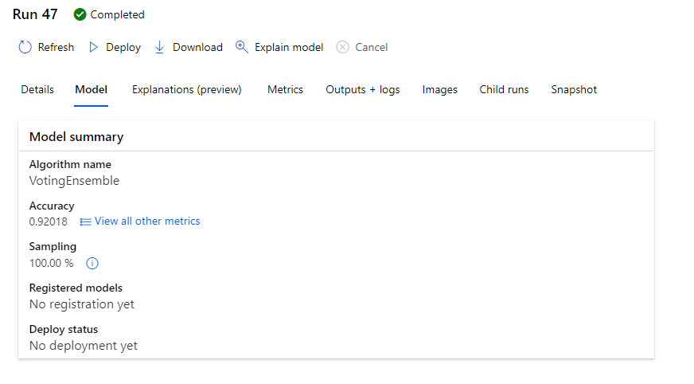
Details of best model. This run 47 is a subrun under the main autoML run 1. It also displays metrics like macro and micro AUC
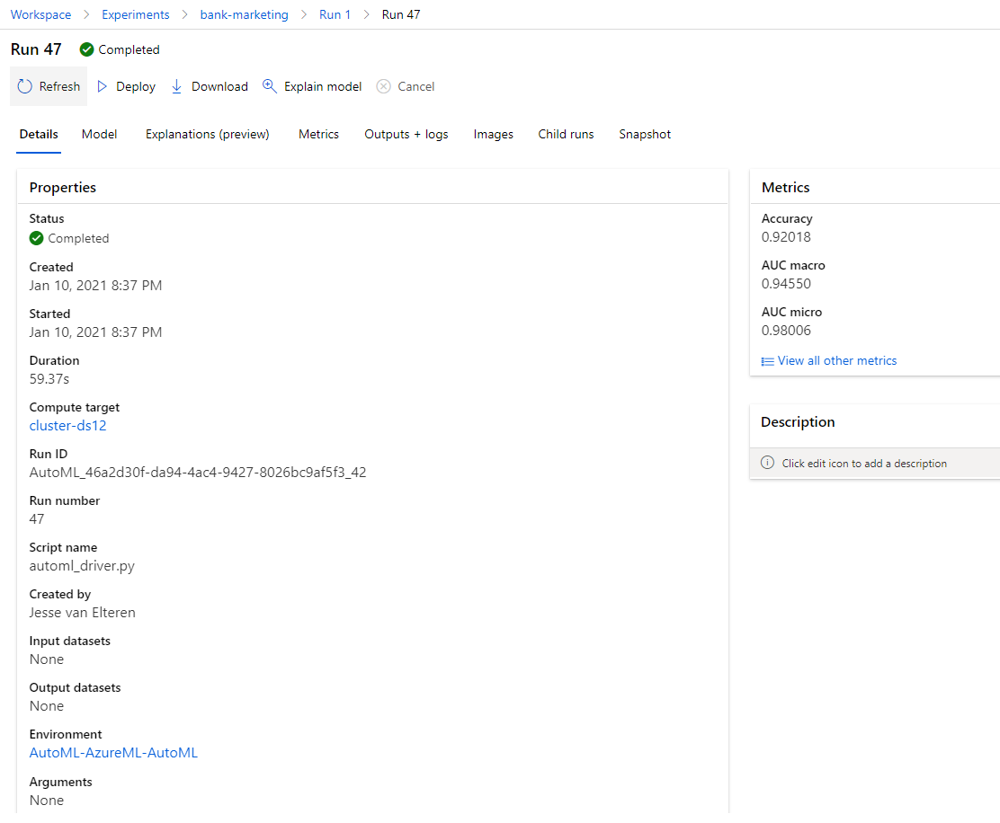
Logs python script output. This shows the logging output of the model. You can see instances of nginx and guvicorn starting up, application insights being enabled and in the end some succesful 200 OK results for swagger.json.
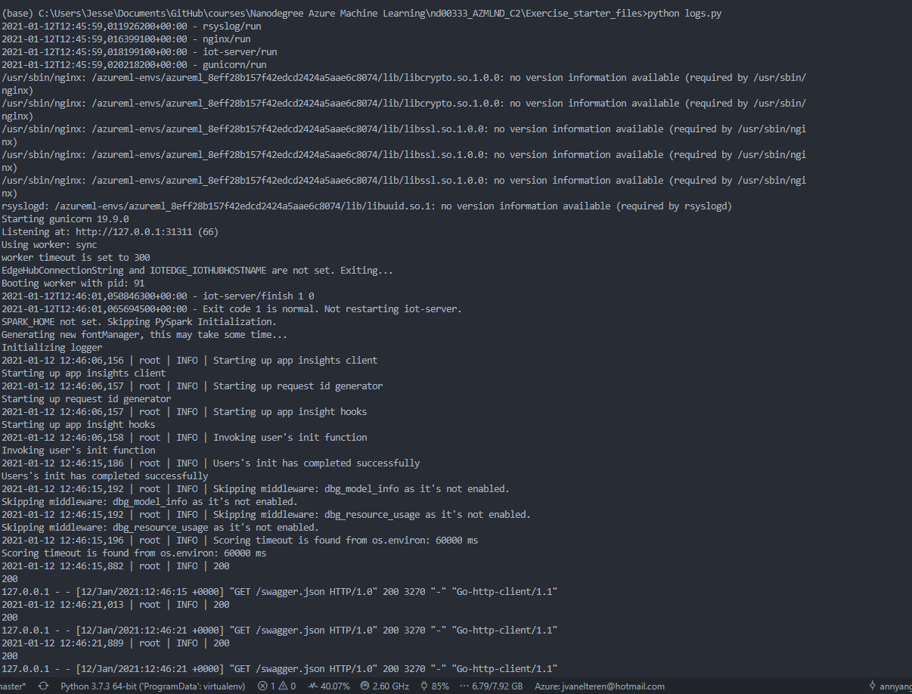
Enabled application insights, on the bottom of the screenshot there is a link to graphically inspect metrics like response time. Application insights can be useful to check if everything is working as planned and spot possible problems.
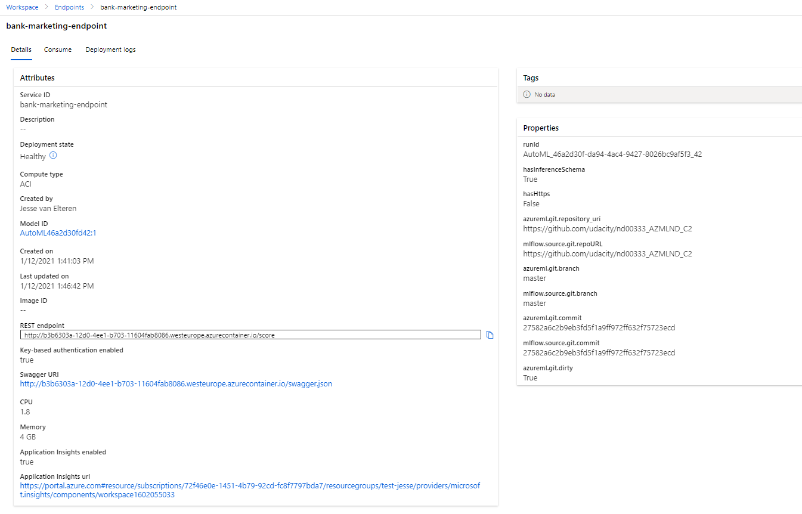
Swagger top of page. Swagger shows the documentation for your endpoint. Here we see the /score endpoint, which requires HTTP POST (with the input). It's very useful, because it shows an example of what the endpoint expects to function well.
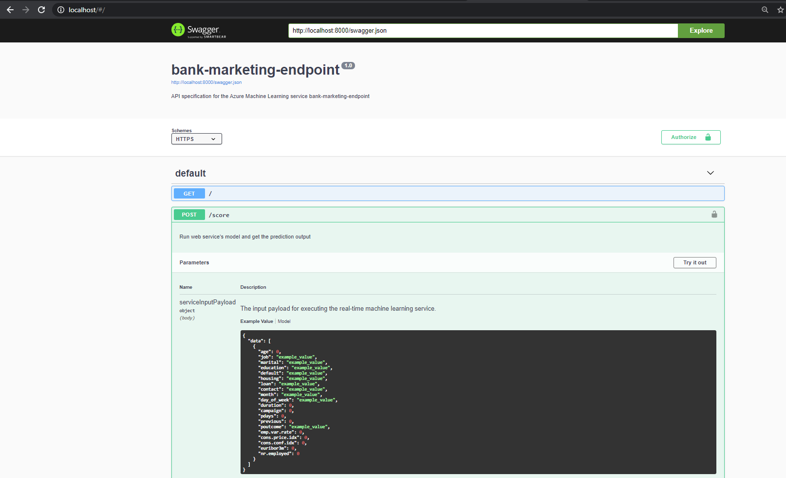
Swagger bottom of page. The possible outputs (200 OK or an error). On the bottom of the page it shows what the AutoML model expects as input and output. Since the /score endpoint essentially runs the model, it's similar to the top of the page.

Result of API consumption. See also the screencast. In this case, two predications were succesfully made, both resulting in a 'no' response.
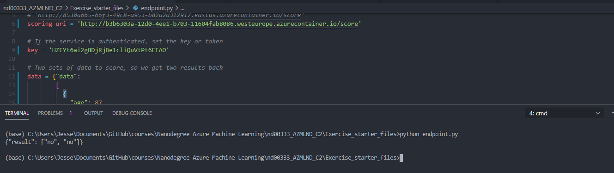
Benchmarking with Apache top op page. Apache Benchmark can be used to simulate traffic to your endpoint, giving insights in how the model performs in terms of response. Here we see the tool making several request, all ending with 200 OK.
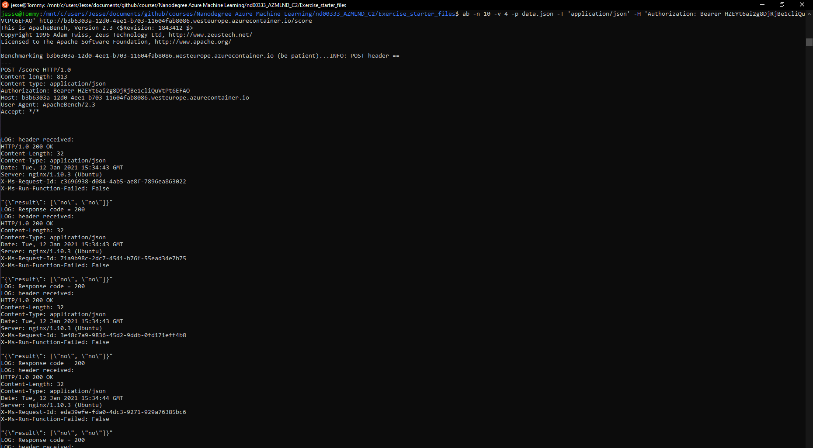
Benchmarking with Apache bottom of page. The benchmark made 10 requests. Especially the bottom table is interesting, since it shows the median response time (243), but also some worse performances, essentially creating a distribution of the response times.
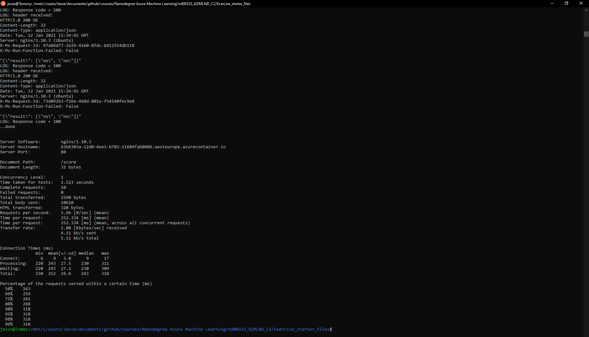
Creation of pipeline. A pipeline is a number of steps strung together. It's very useful for automation, structure and reproducibility. In this case the pipeline consisted of training an AutoML model on the bankmarketing dataset.
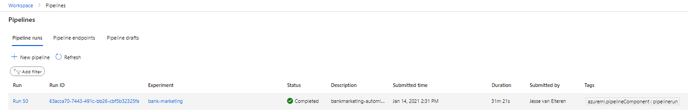
Active pipeline endpoint. The pipeline endpoint makes it possible to active a pipeline by consuming it from HTTP. Note that in this screenshot the endpoint had not yet been consumed.
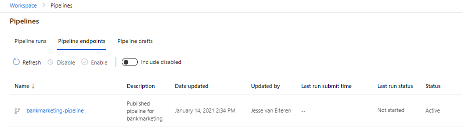
Detail of active pipeline endpoint. The steps are shown, as well as the REST Endpoint to use. The status is active, meaning it can be consumed.
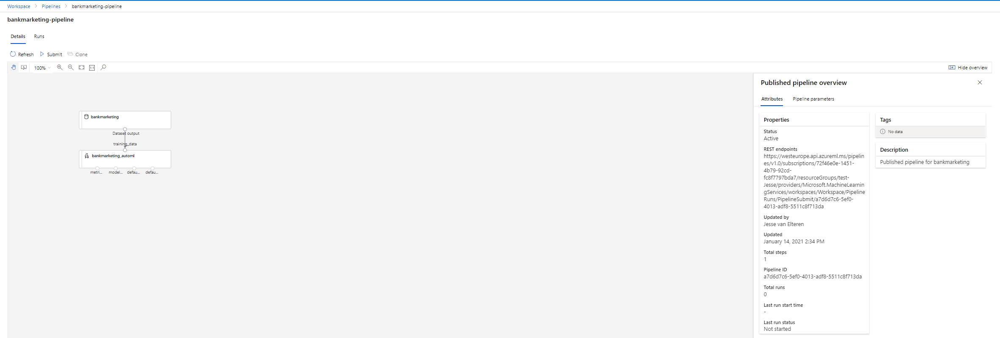
Bankmarketing dataset used as input for AutoML step
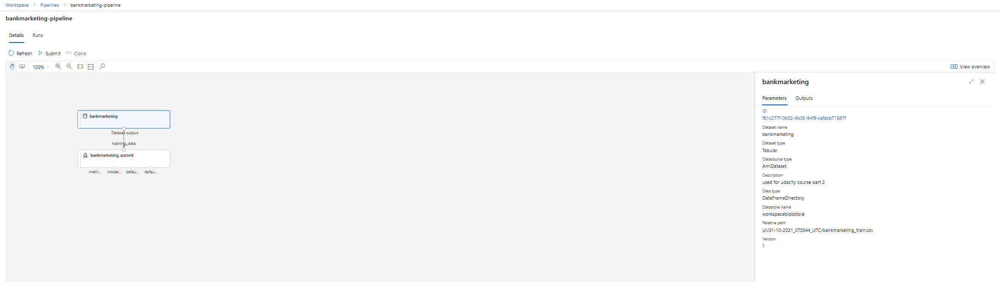
Pipeline run, this basically does the same thing as the next screenshot, but this was the initial pipeline run, not from the endpoint.
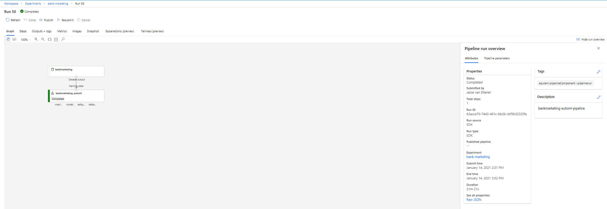
Pipeline run, this basically does the same thing as the previous, but this time, it was automatically initiated by consuming the endpoint, as shown on the right (run type=HTTP).

Here you also see the endpoint run completed succesfully

Run_detail output from jupyter, we see the steps graphically depicted along with some timing information.
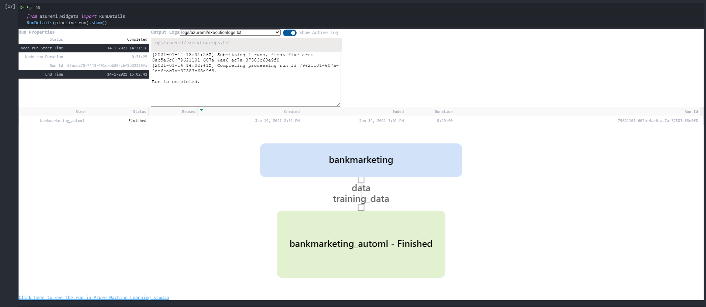